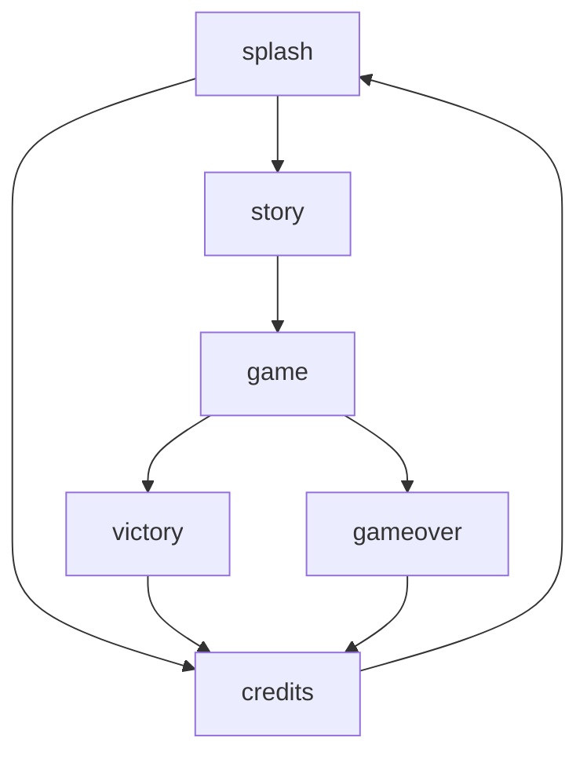

# REENTRii

An April fools joke game for the Wii based on DevKitPPC (DevKitPro), GRRLib.

## Development

```
git clone https://github.com/Sundhaug92/REENTRii Sundhaug92/REENTRii
cd Sundhaug92/REENTRii
git submodule init && git submodule update
```

`.devcontainer/devcontainer.json` automagically configures a development-environment for you in Visual Studio Code. 

- data/ - asset-files converted to .h files and used during the build.
- deps/ - dependencies, currently just the GRRLib submodule.
- Other/ - contains some reference-files used during development but not included in the build.
- source/ - contains the "actual" source-files.


The initial entrypoint of the game is the game-manager, which initializes global call-backs and manages switching between the screens.
Each screen has a screens ID, and a function that takes a reference to the global state and returns a GameModeExit struct.
The GameModeExit struct tells the game-manager which screen it should switch to next unless the game shutdown callbacks have been called.
If the game-manager sees an invalid screen being requested, it will switch to the error-screen and display an error-message.

Screen-transitions:

